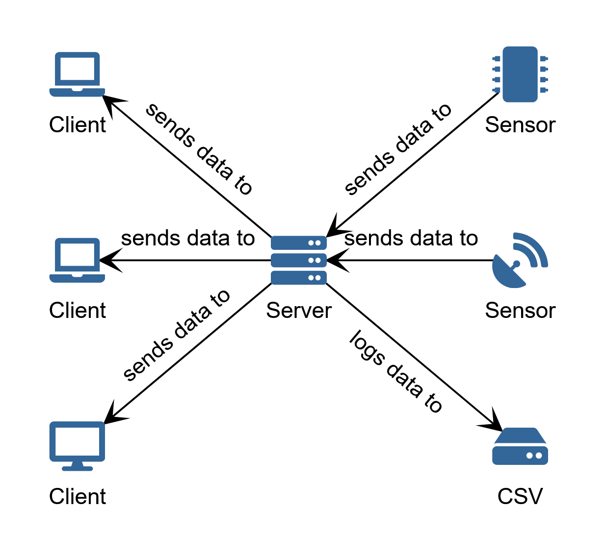
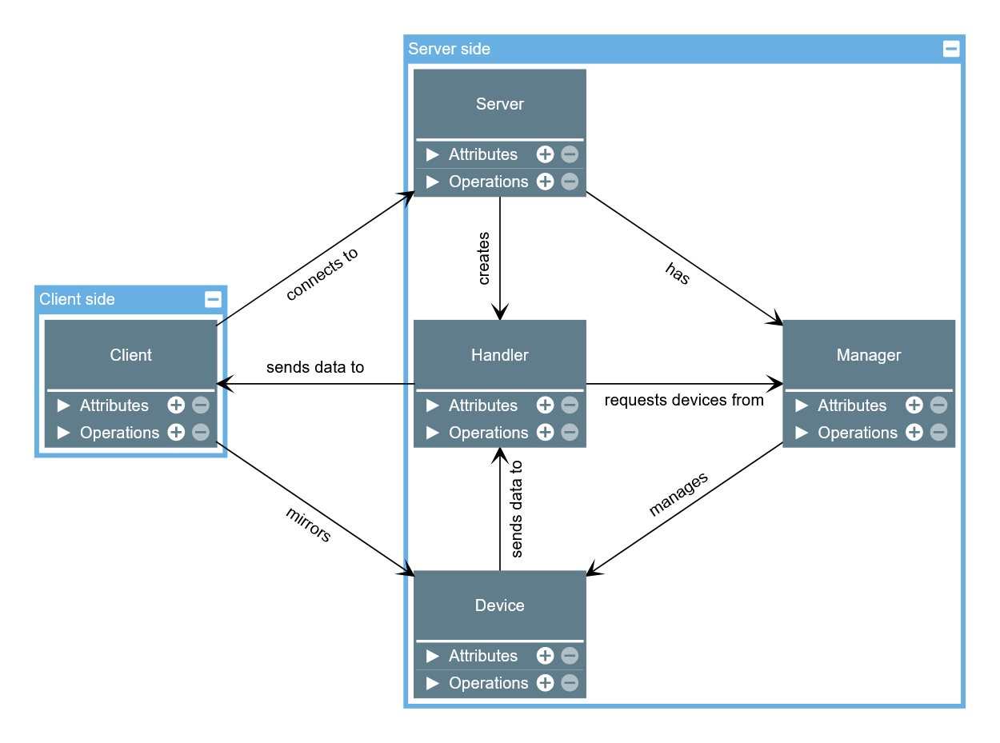

# Plux Adapter

Connects to sensors and distributes their data over TCP/IP allowing connection to incompatible devices, data distribution to multiple clients and aggregated csv logging.

## Installation

For development:
* [https://github.com/biosignalsplux/c-sharp-sample](https://github.com/biosignalsplux/c-sharp-sample) - used to connect to Plux devices, simply drop "plux.dll" and (optional - used for intellisense) "plux.xml" in [PluxAdapter/Servers/lib/PluxDotNet](./PluxAdapter/Servers/lib/PluxDotNet).
* [https://dotnet.microsoft.com/download/dotnet/5.0](https://dotnet.microsoft.com/download/dotnet/5.0) - used to compile code.
* (optional) [https://dotnet.microsoft.com/download/dotnet-framework/net451](https://dotnet.microsoft.com/download/dotnet-framework/net451) - used for intellisense.
* (optional) [https://code.visualstudio.com/](https://code.visualstudio.com/) - used to write code. Note that there are some VSC specific configuration files included in [.vscode](./.vscode). Especially consider [.vscode/launch.json](./.vscode/launch.json), without it VSC can't execute code(note that "dotnet.exe" still can, it's just that VSC can't figure out if it's supposed to use ".NET Framework" or ".NET Core" debugger).

For deployment:
* Just drop [https://docs.microsoft.com/en-us/dotnet/core/tools/dotnet-publish](https://docs.microsoft.com/en-us/dotnet/core/tools/dotnet-publish) result somewhere and execute it(note that [https://dotnet.microsoft.com/download/dotnet-framework/net451](https://dotnet.microsoft.com/download/dotnet-framework/net451) is required for execution, it's shipped with "Windows 8.1" or later).

## Examples

From command line:
* Execute server.
    ```bash
    ./PluxAdapter.Servers.exe
    ```
* Execute client.
    ```bash
    ./PluxAdapter.Servers.exe client
    ```
* Get general help.
    ```bash
    ./PluxAdapter.Servers.exe --help
    ```
* Get server specific help.
    ```bash
    ./PluxAdapter.Servers.exe server --help
    ```

From code:
* Connect to local server from unity and request specific devices:
    ```c#
    using System;
    using System.Threading.Tasks;
    using System.Collections.Generic;

    using UnityEngine;

    using PluxAdapter.Clients;

    public class PluxBehaviour : MonoBehaviour
    {
        private Client.FrameReceivedEventArgs eventArgs;

        private void Start()
        {
            // create new client with default ip and port requesting specific devices
            Client client = new Client(new Client.Options("127.0.0.1", 24242, new List<string> { "BTH00:07:80:46:F0:31", "BTH00:07:80:4D:2D:77" }));
            // update eventArgs with the newest ones
            client.FrameReceived += (sender, eventArgs) => this.eventArgs = eventArgs;
            // start communication
            Task.Run(client.Start);
        }

        private void Update()
        {
            // log the newest received frame counter and data
            if (!(eventArgs is null)) { Debug.Log($"{eventArgs.currentFrame} - {String.Join(", ", eventArgs.data)}"); }
        }
    }
    ```

## Architecture

Plux Adapter is library with command line interface, it has two modes of operation:
* As server it can connect to sensors and distribute their data to clients.
* As client it can connect to server and receive data from sensors.



## Structure

Plux Adapter is structured in the following main classes(note that many other classes are employed, these are just the central ones):
* Program - the main entry point from command line.
* Server - listens for connections from Clients and manages Handlers.
* Handler - negotiates with Client and transfers raw data from Devices.
* Device - manages connection to physical sensor.
* Manager - manages and searches for Devices.
* Client - connects to Server and receives raw data from Handler.



## Logging

Two types of logs are generated(all directories are relative to the main application executable):
* Control logs are located in "logs" directory, these contain general purpose logs of everything of note that's going on in the library. These are configured in [PluxAdapter/Servers/PluxAdapter.Servers.exe.nlog](./PluxAdapter/Servers/PluxAdapter.Servers.exe.nlog).
* Data logs are located in "data" directory, these contain raw data received from sensors. These are stamped with logging start time and sensor path.

## License

For licensing information see [LICENSE](./LICENSE.md).
